# 새로운 CSS 레이아웃

## 제 1장

### float 문제

- **css 코드**
``` css
.cards li {
  float: left;
  width: calc(33.333333333% - 20px);
  margin: 0 10px 20px 10px;
  background-color: darkorange;
}
```
- **html 코드**
``` html
<ul class="cards">
  <li>
    <h1>card1</h1>
    <p>테스트입니다.테스트입니다.테스트입니다.테스트입니다.</p>
  </li>
  <li>
    <h1>card2</h1>
    <p>테스트입니다.테스트입니다.테스트입니다.테스트입니다.</p>
    <p>컨텐츠 추가</p>
  </li>
  <li>
    <h1>card3</h1>
    <p>테스트입니다.테스트입니다.테스트입니다.테스트입니다.</p>
  </li>
  <li>
    <h1>card4</h1>
    <p>테스트입니다.테스트입니다.테스트입니다.테스트입니다.</p>
  </li>
  <li>
    <h1>card5</h1>
    <p>테스트입니다.테스트입니다.테스트입니다.테스트입니다.</p>
  </li>
  <li>
    <h1>card6</h1>
    <p>테스트입니다.테스트입니다.테스트입니다.테스트입니다.</p>
  </li>
</ul>
```

- height가 같은 요소일때는 문제가 발생하지 않지만 height값이 길어지는 경우 문제가 발생한다.
  - `card2`의 컨텐츠 내용이 추가되어 height가 길어질 경우
  - 정상
  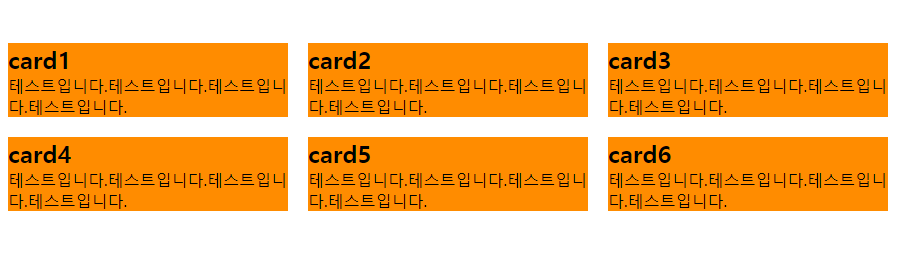
  - 문제
  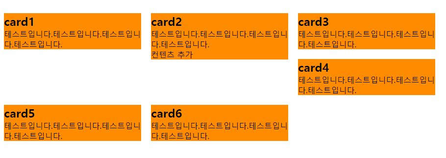
  
  
### float 문제 해결 방법
  - `card1, card2, card3`과 `card4, card5, card6`을 각각 하나의 요소로 감싸고 clearfix 적용하기 각각 요소가 서로의 공간을 침범하지 않게 만든다.
    - 문제 : 마크업 구조를 변경해야 한다.

  - `float`대신 `display: inline-block`을 사용
    - **css 코드**
    ``` css
    .cards li {
      /*float: left;*/
      display: inline-block;
      width: calc(33.333333333% - 20px);
      margin: 0 10px 20px 10px;
      background-color: darkorange;
    }
    ```
    - 문제 : inline요소에는 공백을 그대로 유지한다는 특성을 가지고 있다.(공백을 유지 하지 않으면 inline요소는 띄어쓰기 없이 붙어서 표시) 따라서 공백유지떄문에 한 줄에 2개의 요소만 표시된다.(`margin`값 수정하거나, 마크업을 붙여서 작성하는 방법등을 이용하여 수정가능)
    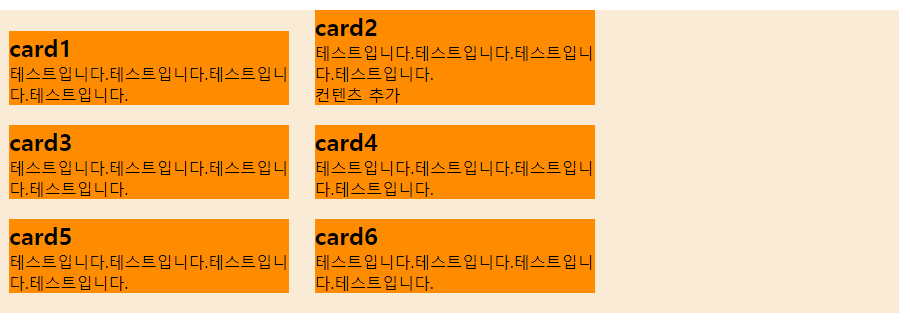

  - `float`대신 `display: table`을 사용
  - `display: table`를 사용해서 테이블 레이아웃의 형태로 변경한다. 자식 요소들도 `tr`요소처럼 `display: table-row`, `td`처럼 `display :table-cell`을 추가한다. 또한 각줄마다 요소로 감싸줘야한다. `vertical-align`으로 수직정렬 가능
    - **css 코드**
    ``` css
    #wrap {
      margin-top: 100px;
      width: 900px;
      background-color: antiquewhite;
      display: table;
      border-spacing: 10px;
    }
    .cards {
      display: table-row;
    }
    .cards li {
      /* float: left; */
      /* display: inline-block; */
      display: table-cell;
      width: calc(33.333333333% - 20px);
      margin: 0 10px 20px 10px;
      background-color: darkorange;
    }
    ```
    - **html 코드**
    ``` html
    <div id="wrap">
      <ul class="cards">...</ul>
      <ul class="cards">...</ul>
    </div>
    ```
    - 문제 마크업 구조를 변경해야 함. 그리고 테이블의 줄과 칸은 margin이 적용되지 않아 `border-spacing`을 사용해야 한다.
    - 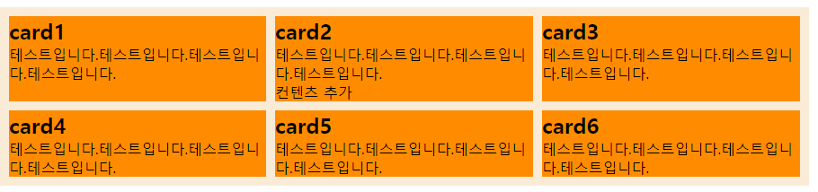


## 제 2장

  ### css 아키텍처
    
  - CSS 아키텍처는 `OOCSS, SMACSS, BEM` 등이 있는데 혼자 CSS를 작업하면 굳이 이런 방식을 과할 수가 있다. 여러명이서 하는 프로젝트라면 아키텍처의 필요성을 느낄 수 있다.
  - 하지만 CSS 아키텍처의 CSS클래스 네임을 사용하다보면 CSS가 마크업가 더 강하게 결합되는 부작용이 존재한다. 
    - 위치와 상관없이 클래스만으로 요소 선택 가능
    - 하지만 아래와 같이 html의 양이 증가된다.

    ``` html
    <div class="menu">
      <ul>
        <li>
          <a href="#">Menu</a>
        </li>
      </ul>
    </div>
    ```
    ``` css
    .menu {}
    .menu ul {}
    .menu ul li {}
    .menu ul li a {}
    ``` 

    - BEM 사용시
    ``` html
    <div class="menu">
      <ul class="menu__list">
        <li class="menu__item">
          <a class="menu__link" href="#">Menu</a>
        </li>
      </ul>
    </div>      
    ```
    ``` css
    .menu {}
    .menu__list {}
    .menu__item {}
    .menu__link {}
    ``` 

  ### 전처리기와 후처리기

    - 전처리기 : `LSES, SASS`와 같이 CSS가 아닌 언어로 CSS를 작성하면 CSS로 컴파일 해주는 도구
    - 후처리기 : CSS 파일이 작성된 후에 적용된다. `AUTOPREFIXER`를 사용하면 구식 브라우저에 필요한 제조사 접두어를 추가
    - 이러한 도구를 사용하면 시간을 상당히 아낄수 있다. 전처리기 같은 경우는 여러사람이 각자 맡은 부분을 작업하고 이 모든 파일을 취합해 하나로 컴파일하는 방식으로 많이 사용된다.
    - 하지만 CSS 명세와 동떨어져 버려 새로운 CSS 신기술을 간과할 수있고 후처리기를 이용하여 불피요한 접두사를 추가할 수도 있다.

  ### 컴포넌트 우선 디자인

  - 아토믹 디자인 : 빈 페이지부터 시작해서 디자인을 완성해가는 대신 가장 작은 구성 요소부터 시작해서 점차 바깥으로 확장하면 디자인 할 것을 권장한다. 이 방식은 프론트 개발자가 1명인 팀에는 조금 과한 면이 있다.

  ### 프레임워크

  - 부트스트랩 : 디자이너, 개발자들이 최서한의 지식을 가지고 웹사이트를 만들 수 있게 해준다. 개성 있진 않지만 개발자가 만든 사이트처럼 끔찍하지는 않다.
  - 모든 프레임워크에는 만든 사람의 의도와 요구 사항이 담겨 있고 그러한 의도와 요구 사항이 자신의 요구 사항과 일치할 수도 그렇지 않을 수도 있다.

  ### 기타

  - 성능 :  HTTP 아카이브는 2016년 12월에 웹 페이지 평균 다운로드 크기가 2.4MB 이상이라고 한다. 인터넷 속도가 느린 곳도 생각하여 속도도 염두에 두는 것이 좋다.
  - 접근성 : 새로운 명세 덕분에 시각적인 표현 선수를 재배열 할 수 있게 된 만큼 이를 세심하게 주의를 기울여서 사용해야 한다.
  - 자동으로 업데이트 되는 브라우저 : 크롬, 파폭 등 자동으로 업데이트 되는 브라우저가 많아졌으나 내부 정책 때문에 사용할 수 있는 브라우저가 정해진 곳이 여전히 존재한다. 추후 언젠가 업데이트를 대비해 코드를 추가로 작성하지 않고도 브라우저가 업데이트 될때 스스로 진화하는 듯 보이는 웹사이트를 제작해야 한다.

## 제 3장

  ### CSS의 양식화 문맥

  - [https://drafts.csswg.org/css-display-3/#formatting-context](https://drafts.csswg.org/css-display-3/#formatting-context)
  - 양식화 문맥이 다르면 다른 규칙에 따라 상자를 배치합니다. 예를 들어, 플렉스 양식화 문맥은 CSS3 FLEXBOX라는 플렉스 레이아웃 규칙에 따라 상자를 배치하고, 블록 양식화 문맥은 CSS2의 블록과 인라인 레이아웃 규칙에 따라 상자를 배치합니다.

  - 블록 양식화 문맥(BFC) : 요소에 새로운 블록 양식화 문맥을 작성하면 그 **요소의 자식 요소에 적용할 독립적인 레이아웃 환경**을 만들 수 있다.
  - 아래와 같은 조건을 만족하면 새로운 BFC가 만들어진다.
    - root 요소일때
    - float값이 none이 아닐때
    - position: static, relative이 아닐때
    - overflow: visible이 아닐떄
    - display: table-cell, table-caption, inline-block, flex, inline-flex, grid 일때

  - `box`가 `float: left`인 상태일때

  ``` css
  .container {
    width: 400px;
    border: 2px solid orangered;
    border-radius: 5px;
  }
  .box {
    float: left;
    width: 200px;
    border: 2px solid #e5dbff;
    border-radius: 5px;
    padding: 10px;
  }
  ```

  ``` html
  <div class="container">
    <div class="box">
      <p>I am floated left.</p>
    </div>
  </div>
  ```
  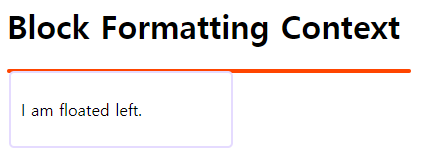

  - `box`가 플로팅되면 부모인 `container`가 줄어든다.
  - 위에서 말한 `container`에 BFC를 만들어주면 `요소의 자식요소에 적용할 독립적인 레이아웃`을 만들면서 모든 것을 내부에 표현합니다. 따라서 `box`가 `container`안으로 들어갑니다.
  - BFC를 만들기 위해 `overflow: hidden`, `float:left`를 사용할 수 있다.
  - `overflow: hidden` 적용 코드
    ``` css
    .container {
      width: 400px;
      border: 2px solid orangered;
      border-radius: 5px;
      overflow: hidden;
    }
    ```
  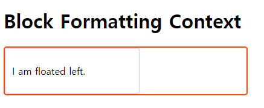

  - 하지만 `overflow: hidden`은 플로팅을 제거할 목적으로 만들어진 것이 아니라서 `box-shadow`가 짤리는 현상이 있다.
  - 따라서 새로운 BFC를 만들 목적으로 나온 `display: flow-root`를 사용하면 된다. 이 값을 지원하는 브라우저에서는 새로우 BFC만 만들고 다른 부작용은 없다.

  ### 흐름 내부과 외부

  - 요소를 `floating`하거나 `position: absolute, fixed`하면 흐름에서 벗어난다.
  - 블록수준 요소의 양식화 모델에 따르면 별다른 제약이 없는 경우 **요소는 컨테이너의 너비만큼 넓어지고 새로운 줄에 표현**
  - 인라인 요소는 **공간이 있을 경우 다른 요소 바로 뒤에 표시**
  - ~~플로팅된 요소는 블록 수준의 요소를 만날 때까지 위로 이동하고~~(모르겠다) 그 뒤에 요소들은 플로팅된 요소 옆으로 늘어섭니다.
  - 블록요소 텍스트는 플로팅 된 요소 주변으로 배치되고 배경색은 너비만큼 차지한다.
    ``` css
    .container {
      width: 400px;
      border: 2px solid #d0bfff;
      border-radius: 5px;
      overflow: hidden;
    }
    .box {
      float: left;
      width: 200px;
      border: 2px solid #d0bfff;
      border-radius: 5px;
      padding: 10px;
    }
    .box > p {
      background-color: khaki;
    }
    .container > p {
      background-color: orange;
    }
    ```
    ``` html
    <div class="container">
      <div class="box">
        <p>I am floated left. I am out of flow.</p>
      </div>
      <p>I am a paragraph of text inside the container. I am in-flow. My text wraps around the float but my background color extends behind the floated item.</p>
    </div>
    ```
    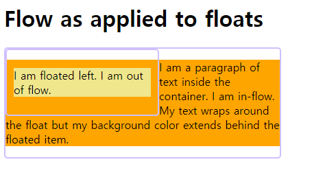

  ### 플렉스박스

  - 3개의 목록을 가진 요소에 `display: flex`를 설정하면 3개의 목록이 `flex-item`으로 바뀐다. flexitem은 기본값으로 한줄로 배열되고 플렉스 컨테이너 높이만큼 길이가 늘어난다. 모든 아이템은 그안에 컨텐츠의 길이와 상관없이 높이가 똑같아진다.
  - 목록이 추가되면 `min-content`로 정해진 너비보다 작아질 수 없으므로 플렉스 컨테이너를 벗어나게 된다. `min-content`는 단어중 가장 긴 것을 기준으로 한다.
  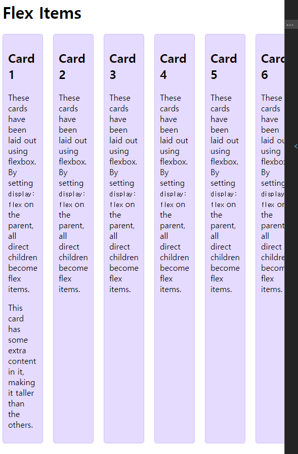
  - 이럴땐 `flex-wrap: wrap;`을 사용하면 컨텐츠 길이만큼 늘어나서 1줄로 나오게 된다.
  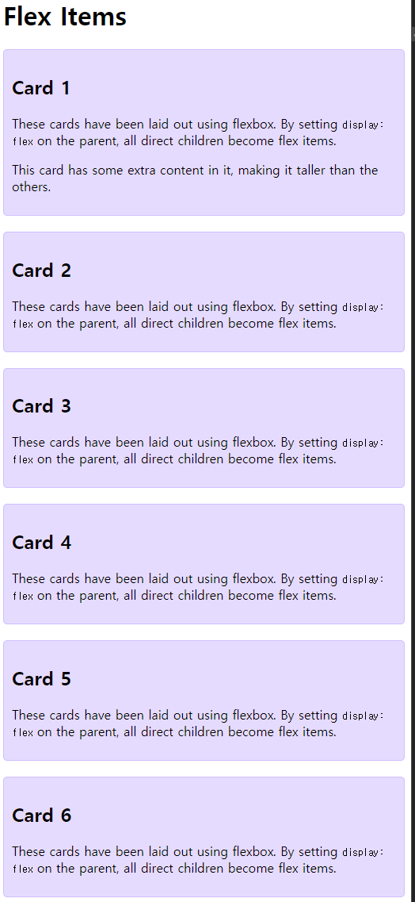
  - 줄바꿈을 하기 위해서는 플렉스 아이템에도 `flex`속성을 추가한다. `flex: 1 1 200px;` 너비가 최소 200px로 맞춰져서 200px이하로 될 경우 줄바꿈이 된다. flex 관련은 추후 설명
  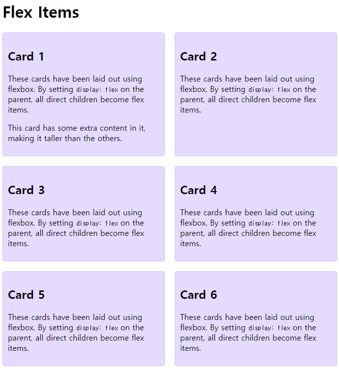
  - 만약 1개라도 목록이 삭제되면 그리드 효과는 사라지고 삭제된 자리는 나머지 목록이 채웁니다. 다음 줄로 넘어가면 새로운 줄이 플렉스 컨테이너가 됩니다. column도 마찬가지 즉, 플렉스 아이템이 다음 칼럼으로 넘어가면 새로운 칼럼이 플렉스 컨테이너가 됩니다. 이는 곧 **각 줄마다 개별적으로 사용 가능한 공간을 할당한다는 뜻입니다. 플렉스박스는 바로 위나 아래에 있는 다른 플렉스 박스와 선을 맞추어 정렬하지 않습니다. 이를 가리켜 1차원 레이아웃이라고 부릅니다.**
  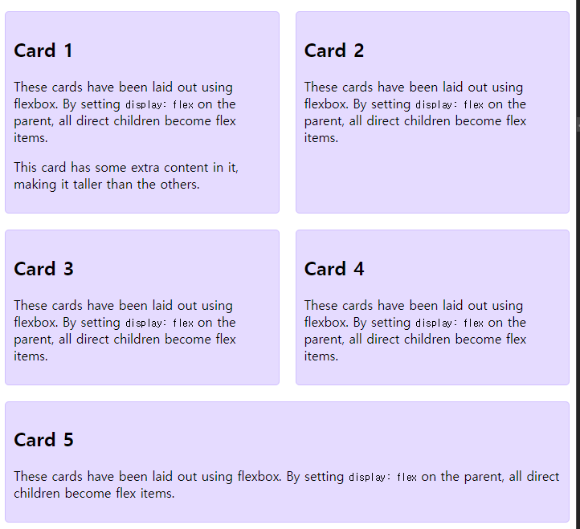
  - 플렉스 박스가 그리드처럼 동작하게 하려면 유연성을 제한해야 합니다. 1장에서 플롯 기반 레이아웃을 만들려면 `flex-grow, flex-shrink 값을 0으로 변경하고 flex-basis: auto`로 설정합니다. 이 설정은 플렉스 아이템에 주어진 퍼센트(width) 너비 이상으로 커지거나 줄어들지 않습니다. 다시 말해 한 줄에 플렉스 아이템이 2개밖에 없더라도 나머지 공간을 다 차지하기 위해 넓어지지 않습니다. float을 사용한 그리드처럼 각 플렉스 아이템 사이의 간격도 포함해야 합니다.
  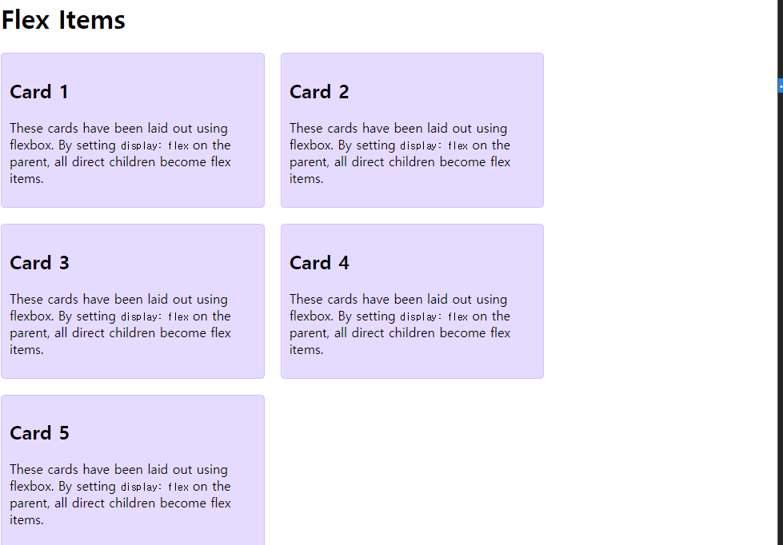

  ``` css
  .cards li {
    width: calc(33.333% - 20px);
    flex: 0 0 auto;
  }
  ```
  
  ### 그리드 레이아웃

  - 이 명세는 2차원 레이아웃을 다루고 있다. 즉, row, column을 동시에 제어하고 배치할 수 있다. `display: grid`가 적용되어잇고 `grid-template-columns: 1fr 1fr 1fr`로 3개의 column을 생성하고 새로운 단위인 `fr`를 이용해 사용 가능한 공간을 3개로 나누되 균등한 비율로 나누었다.
  - 별도로 너비 설정 안해도 되고, `margin` 대신 `grid-gap`을 이용 
    ``` css
    .cards {
      margin: 0;
      padding: 0;
      list-style: none;
      display: grid;
      grid-template-columns: 1fr 1fr 1fr;
      grid-gap: 20px;
    }

    .cards li {
      background-color: #e5dbff;
      border: 1px solid #d0bfff;
      padding: 10px;
      border-radius: 5px;
    }
    ```
    ``` html
    <div class="example">
      <ul class="cards">
        <li>
          <h2>Card 1</h2>
          <p>These cards have been laid out using grid layout. By setting <code>display: grid</code> on the
              parent, all direct children become grid items.</p>
        </li>
        <li>
          <h2>Card 2</h2>
          <p>These cards have been laid out using grid layout. By setting <code>display: grid</code> on the
              parent, all direct children become grid items.</p>
        </li>

        <li>
          <h2>Card 3</h2>
          <p>These cards have been laid out using grid layout. By setting <code>display: grid</code> on the
              parent, all direct children become grid items.</p>
        </li>
        <li>
          <h2>Card 4</h2>
          <p>These cards have been laid out using grid layout. By setting <code>display: grid</code> on the
              parent, all direct children become grid items.</p>
        </li>
        <li>
          <h2>Card 5</h2>
          <p>These cards have been laid out using grid layout. By setting <code>display: grid</code> on the
              parent, all direct children become grid items.</p>
        </li>
      </ul>
    </div>
    ```
    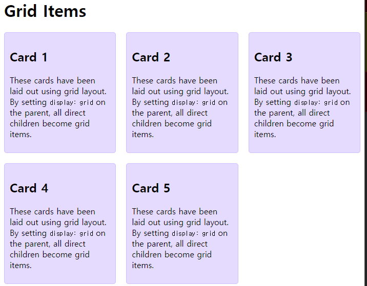

    - 그리드를 사용한 아이템 배치
    - 오른쪽으로 읽는 언어(LTR), 왼쪽으로 읽는 언어(RTL)에 따라 번호의 순서가 달라진다.
    - `grid-column, grid-row`를 사용해 2차원 그리드의 장점인 row, column영역 조절이 가능하다.

    ``` css
    .card1 {
      grid-column: 1 / 3; /*1컬럼부터 2컬럼까지*/
      grid-row: 1;
    }
    .card2 {
      grid-column: 3; /*3컬럼만*/
      grid-row: 1;
    }
    .card3 {
      grid-column: 1; /*1컬럼만*/
      grid-row: 2 / 4; /*2로우에서 3로우까지*/
    }
    .card4 {
      grid-column: 2 / 4; /* 2컬럼에서 3컬럼까지 */
      grid-row: 2;
    }
    .card5 {
      grid-column: 2 / 4;
      grid-row: 3;
    }
    ```
    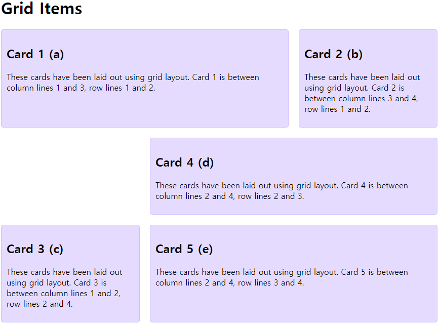

    - 그리드 아이템에 이름을 지어줄 수 있다.
    - 위와 같은 결과 (`.`은 공백을 나타낸다)
    ``` css
    .card1 { grid-area: a; }
    .card2 { grid-area: b; }
    .card3 { grid-area: c; }
    .card4 { grid-area: d; }
    .card5 { grid-area: e; }

    .cards {
      ...
      grid-template-area:
      "a a b"
      ". d d"
      "c e e"
    }
    ```

  ### 기타

  - `shape-out-side`
    ``` css
    .example img {
      float: left;
      display: block;
      shape-outside: circle(50%);
    }
    ```
    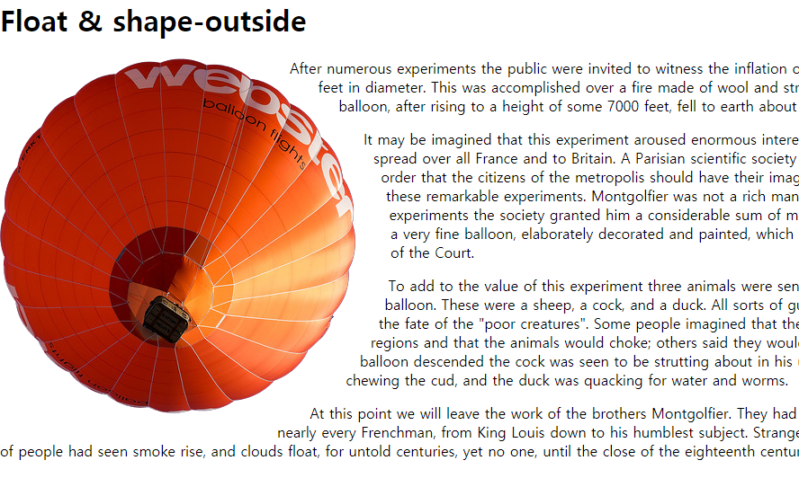

  - `position: sticky`
    - 화면이 해당 영역으로 들어오면 `fixed` 속성과 같이 고정됨. 영역 들어오기전에는 `static`으로 동작
    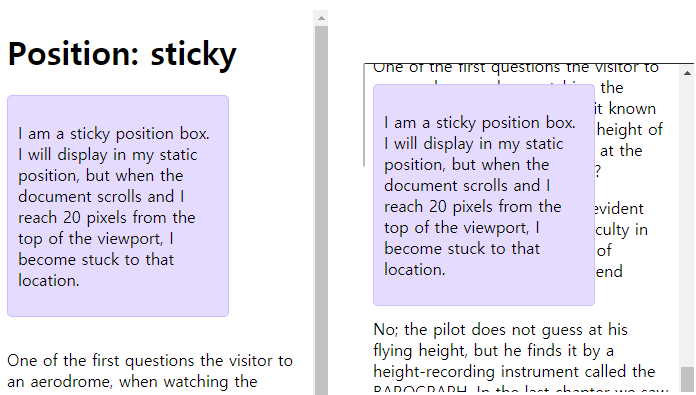

  - 멀티 칼럼 레이아웃
    ``` css
    .example {
      column-count: 3;
      column-width: 300px; /*화면의 너비가 줄어들면서 컬럼의 너비가 300px 이하가 되면 끝에 있는것부터 없어지고 앞에꺼랑 합쳐진다.*/
    }
    ```
    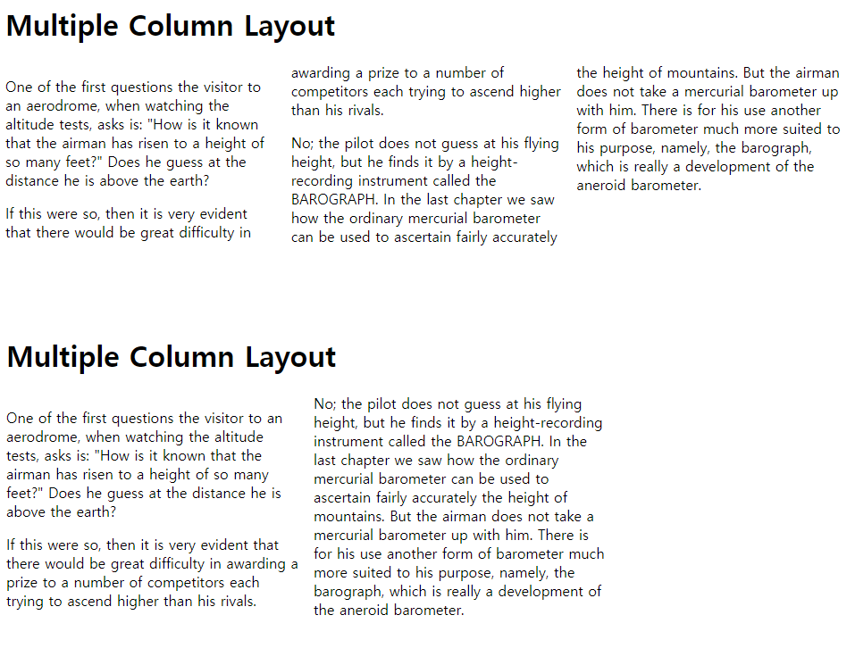

## 제 4장

  ### 플렉스 아이템 배치

  - 플렉스 아이템이 컨테이너 height 만큼 커지는 이유는 기본값이 `stretch`이기 떄문이다.

  ``` css
    .cards {
      margin: 0 -10px;
      padding: 0;
      list-style: none;
      display: flex;
      /* align-items: stretch; 기본값 */
      /*align-items: flex-start*/
      /*align-items: flex-end*/
      flex-wrap: wrap;
    }
  ```

  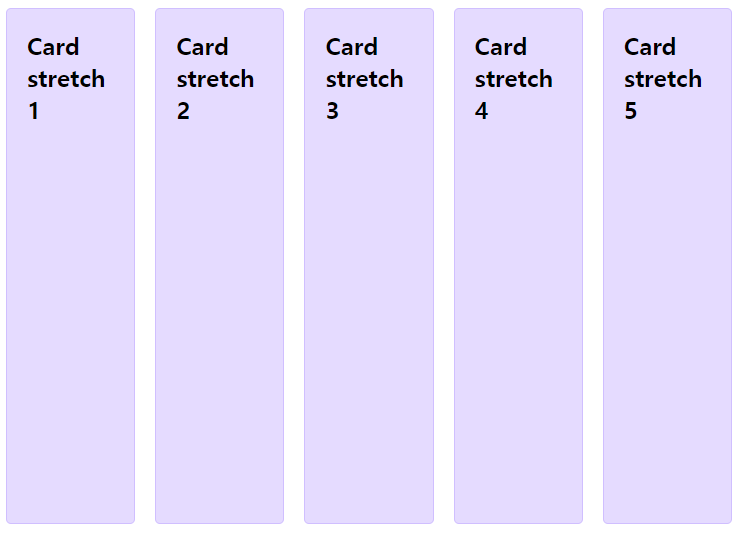

  ---

  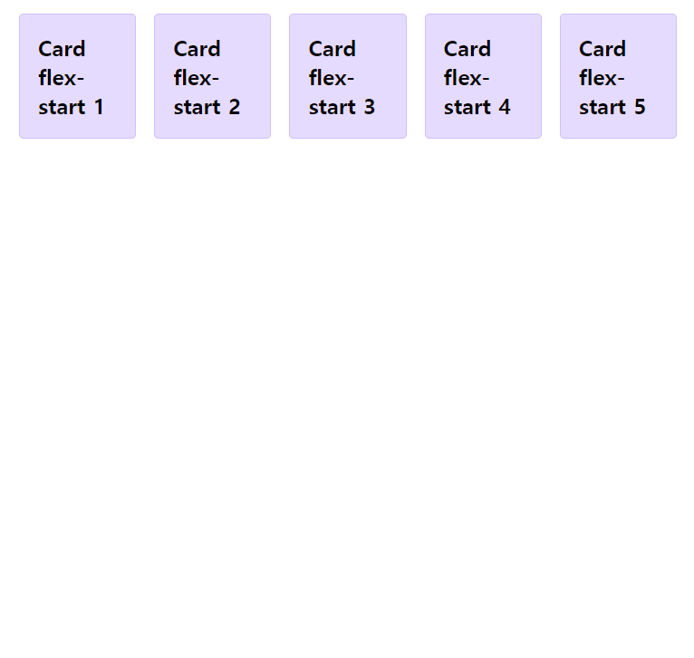

  ---

  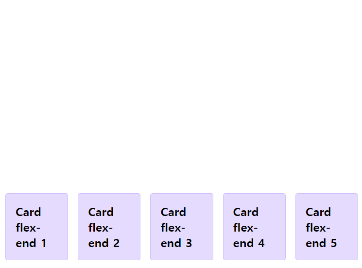

  - 개별적으로 원하면 플렉스 아이템에 `align-self`를 적용하면 된다.
  ``` css
    .cards li:first-child {
      align-self: flex-end;
    }
  ```
  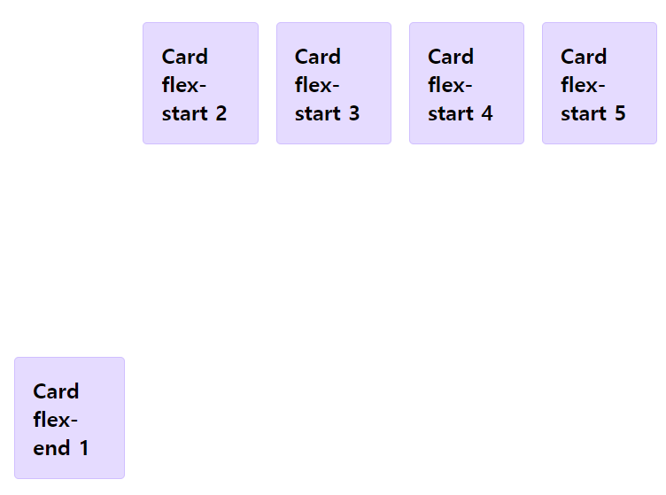

  - 아이템은 교차축(cross-axis)에서 이루어집니다. 수직
  - `flex-direction: column`으로 변경하면 교차축이 수평이 되어 아래와 같이 된다.

  ``` css
    .cards {
      ...
      flex-direction: column;
    }
  ```

  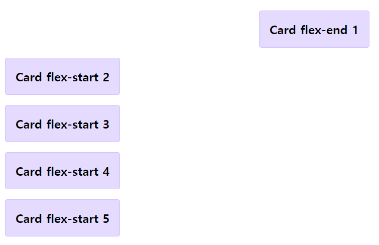

  ### 그리드 아이템 배치

  - 그리드 아이템도 마찬가지로 `align-items: stretch`가 기본값이다.
  - 개별적으로 원하면 역시 `align-self`를 사용하면 된다.

  ``` css
  .cards {
    margin: 0;
    padding: 0;
    list-style: none;
    display: grid;
    grid-template-columns: repeat(4, 1fr);
    grid-template-rows: repeat(3, 100px);
    grid-template-areas:
      "a a a b"
      "a a a b"
      "c d d d";
    grid-gap: 20px;
    align-items: start;
  }

  .one {
    grid-area: a;
  }

  .two {
    grid-area: b;
    align-self: stretch;
  }

  .three {
    grid-area: c;
    align-self: flex-end;
  }

  .four {
    grid-area: d;
    align-self: center;
  }

  .cards li {
    background-color: #e3fafc;
    border: 1px solid #99e9f2;
    padding: 10px;
    border-radius: 5px;
  }
  ```

  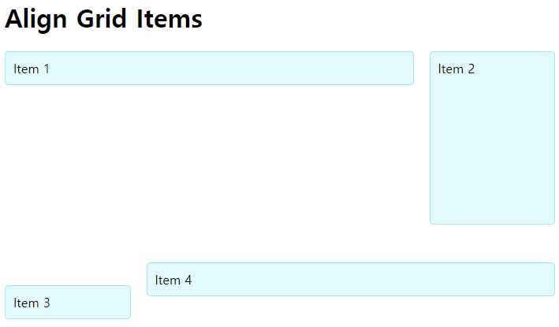

  - 메인 축을 정렬하려면 `justify-items`를 사용하고 개별적으로는 `justify-self`를 설정한다. Item4를 `d`로 설정하고 `stretch`를 적용했다.

  ```css
  .cards {
    margin: 0;
    padding: 0;
    list-style: none;
    display: grid;
    grid-template-columns: repeat(4, 1fr);
    grid-template-rows: repeat(3, 100px);
    grid-template-areas:
      "a a a b"
      "a a a b"
      "c d d d";
    grid-gap: 20px;
    justify-items: end;
  }

  .four {
    grid-area: d;
    justify-self: stretch;
  }
  ```

  ### 플렉스 아이템 정렬

  - 플렉스박스에는 축이 1개밖에 없고 주축(main axis)에 여러 아이템을 둘 수 있기 때문에 `justify-items`, `justify-self`속성을 적용하지 않는다.
  - 가끔 주축 위에 아이템을 일정한 간격으로 배치하고 싶을때는 플렉스 컨테이너 전체에 영향을 주는 `justify-content`를 사용한다. 주축 기준이고 `flex-direction`이 `row`라면 가로줄, `column`이라면 세로줄이다. 초기값은 `flex-start` 그래서 `display: flex`주고 아무것도 설정안하면 시작 부분에 늘어선다.
  - 반대로 `flex-end`를 주면 컨테이너 끝에 늘어선다.

  ``` css
  .cards {
    margin: 0 -10px;
    padding: 0;
    list-style: none;
    display: flex;
    justify-content: flex-end;
    height: 50vh;
  }

  .cards li {
    background-color: #e3fafc;
    border: 1px solid #99e9f2;
    margin: 0 10px 20px 10px;
    padding: 10px;
    border-radius: 5px;
  }
  ```
  ``` html
  <div class="example">
    <ul class="cards">
      <li>Item 1</li>
      <li>Item 2</li>
      <li>Item 3</li>
      <li>Item 4</li>
    </ul>
  </div>
  ```

  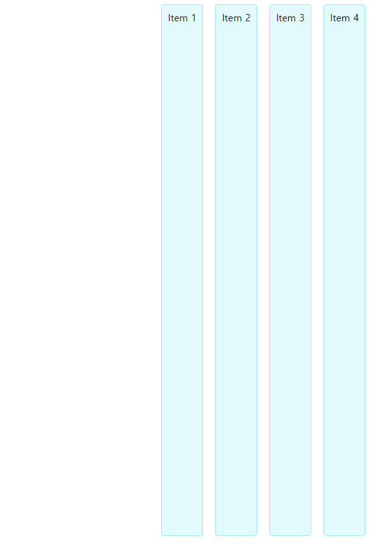

  - `space-between`: 양끝 붙고 아이템 사이 일정한 간격
  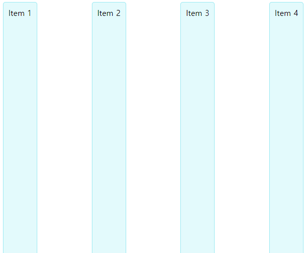
  - `space-around`: 양쪽 동일한 마진값
  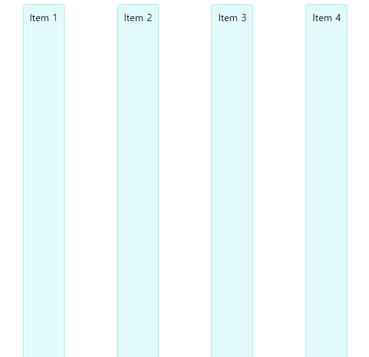
  - `space-evenly`: 모든 공백 균등하게 배분
  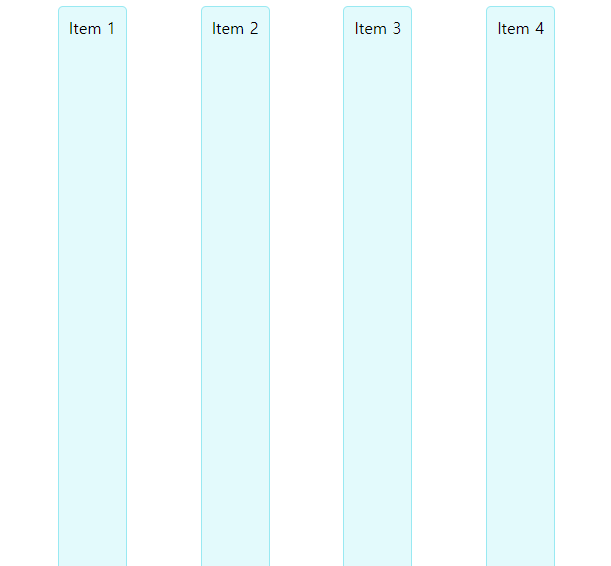


  ### 플렉스 사용한 가운데 정렬

  - 플렉스를 사용해 가운데 정렬하기(이전에는 position: absolute를 사용하거나 table을 이용한 방법 등)

  ``` css
  .example {
    display: flex;
    justify-content : center;
    align-items: center;
  }
  ```
  ``` html
  <div class="example">
      가운데 할 요소
  </div>
  ```

  ### 플렉스박스의 `align-content` 속성

  - 플렉스박스의 `align-content`는 교차죽(Cross-axis)에서 동작, 아래와 같을 경우 동작
    - `flex-wrap` 속성의 값이 `wrap`일 때
    - 아이템을 배치하기 위해 필요한 공간보다 컨테이너가 길 때
    ``` css
    .cards {
      display: flex;
      flex-wrap :wrap;
      height: 50vh;
    }

    .cards li {
      flex: 1 1 250px;
    }
    ```
  
  - 기본값은 `strecth`
  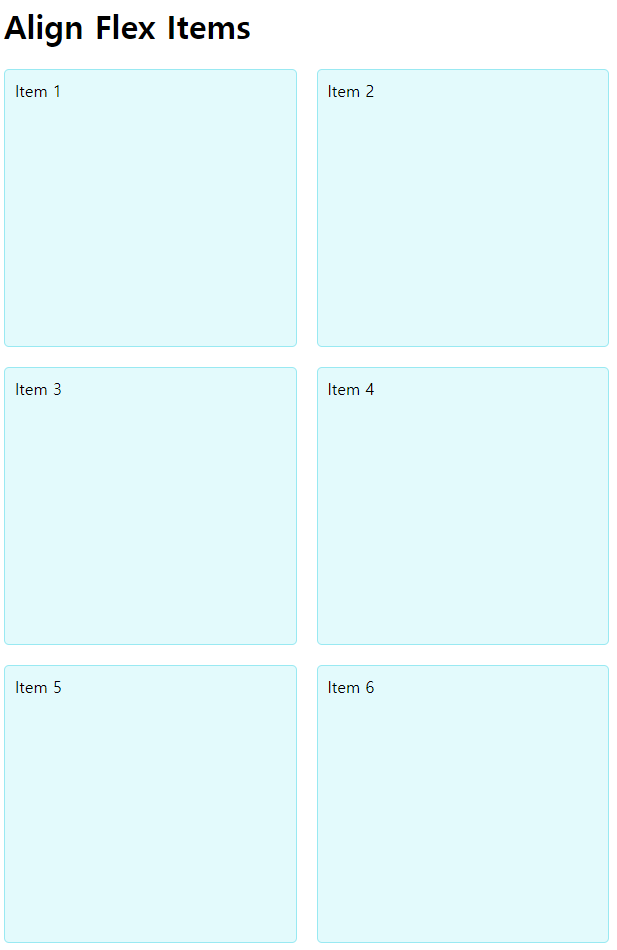

  - `align-content: space-between` : 처음과 끝에 붙고(사용할 수 있는 공간 모두 사용) 중간 공간 분배

  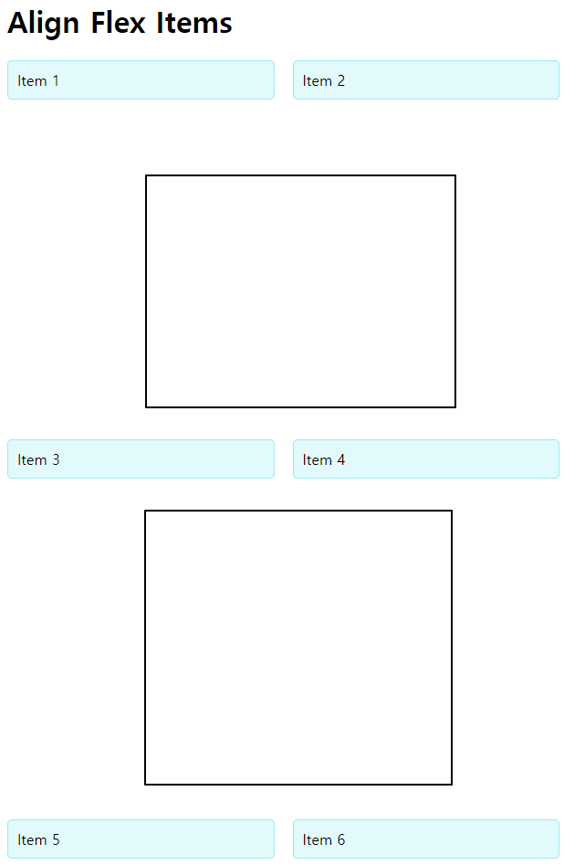

  ### 그리드 트랙과 배치와 정렬

- `align-content`, `justify-content` 속성은 그리드 레이아웃의 트랙에 영향을 줍니다. 둘다 `space-between`을 사용하면 컨테이너 너비와 높이를 모두 채울 수 있습니다.

``` css
.cards {
  margin: 0;
  padding: 0;
  list-style: none;
  display: grid;
  grid-template-columns: repeat(4, 15%);
  grid-template-rows: repeat(3, 100px);
  height: 50vh;
  grid-template-areas:
    "a a a b"
    "a a a b"
    "c d d d";
  grid-gap: 20px;
  /*align-content: space-between;*/
  /*justify-content: space-between;*/
}
```

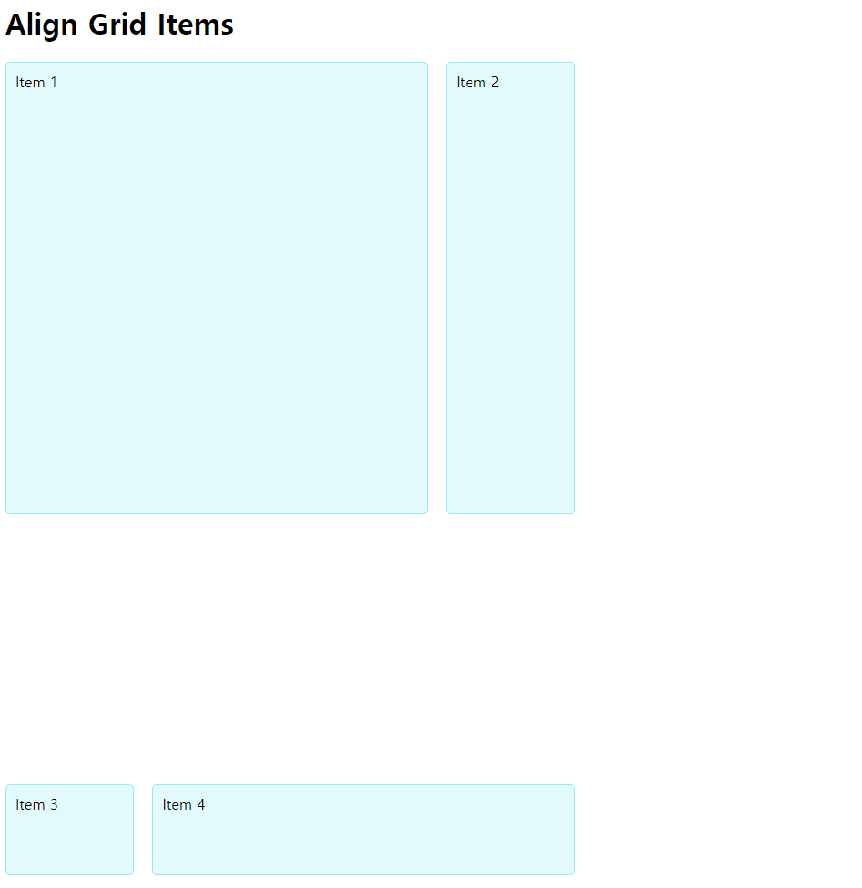

- `space-between`
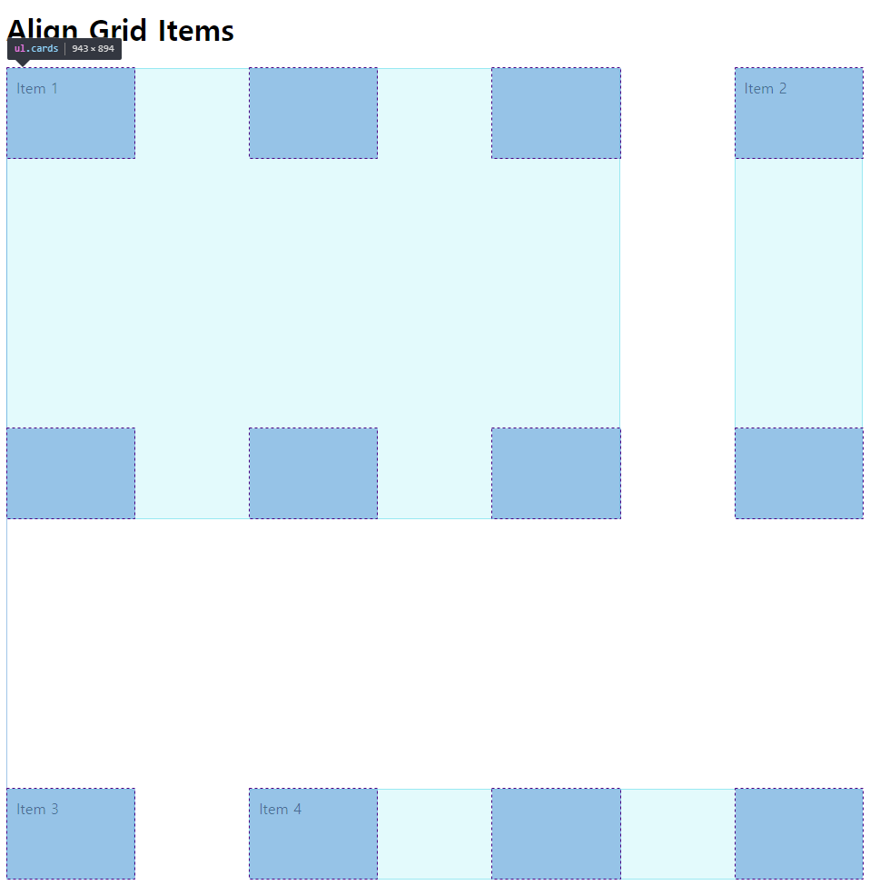

### 플렉스 자동마진

- 1차원이라서 `justify-items`가 적용되지 않는다. 하지만 같은 줄에 플렉스 박스 1개만 다른 방식으로 배치하고 싶을때는 자동마진을 사용한다.

``` css
.cards {
  margin: 0 -10px;
  padding: 0;
  list-style: none;
  display: flex;
}

.cards li {
  background-color: #e3fafc;
  border: 1px solid #99e9f2;
  margin: 0 10px 20px 10px;
  padding: 10px;
  border-radius: 5px;
}

.cards li:last-child {
  margin-left: auto;
}
```
``` html
<ul class="cards">
  <li>Item 1</li>
  <li>Item 2</li>
  <li>Item 3</li>
  <li>Item 4</li>
</ul>
```
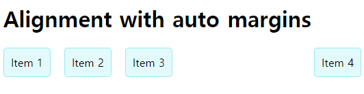


### 논리적 속성과 물리적 속성

- 물리적 속성 : `left, right, top, bottom` 어떤 요소가 화면에서 물리적으로 어디에 위치하는지 알려준다.
- 논리적 속성 : 물리적 속성의 경우 설정된 글쓰기 모드에 따라 문제가 발생하므로 논리적인 속성을 사용한다. `start, end`와 같은 것들